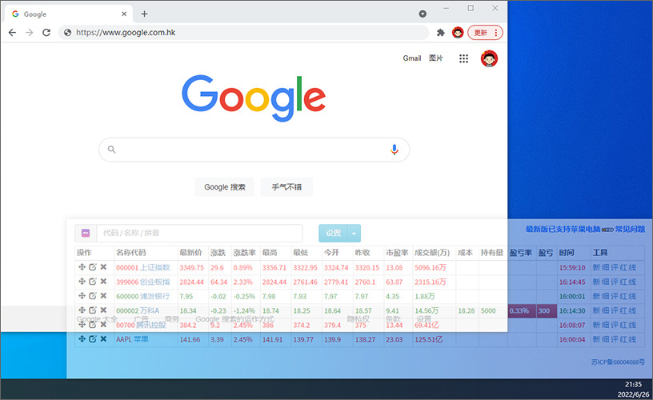
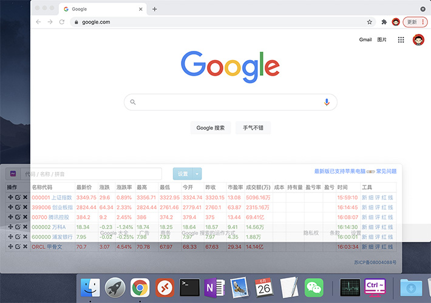

  
Shadowin 影窗浏览器 —— 支持系统热键的隐蔽浏览器
-------------------------------------------
提供让人兴奋的`老板键`和`透明窗体`特性，在上班族圈子里非常受欢迎。  
我们的口号是：幸福生活、快乐工作、适当酱油！  

`V4.x`: 使用 [Electron] 方案重构，现已支持全平台。[下载地址]  
|V4 热键	|效果			|
|----		|----			|
|`Ctrl + ~`	|显示/隐藏窗口	|
|`Ctrl + ]`	|增大窗口不透明度	|
|`Ctrl + [`	|减小窗口不透明度	|
|`Ctrl + ,`	|切到左侧屏幕	|
|`Ctrl + .`	|切到右侧屏幕	|
|`Ctrl + \`	|退出程序		|
  
`V3.x`: 基于 [.NET] 开发，仅支持 Windows。[预编译包]  
|V3 热键	|效果			|
|----		|----			|
|`Ctrl + ~`	|显示/隐藏窗口	|
|`Ctrl + ↑`	|增大窗口高		|
|`Ctrl + ↓`	|减小窗口高		|
|`Ctrl + ←`	|增大窗口宽		|
|`Ctrl + →`	|减小窗口宽		|
|`Ctrl + +`	|增大窗口不透明度	|
|`Ctrl + -`	|减小窗口不透明度	|
|`Ctrl + 0`	|退出程序		|
  
* `Shadowin 影窗浏览器`已默认内置`ShadowStock 影子证券`。  
*  使用中遇到问题，请参看[常见问题]。
  
  
ShadowStock 影子证券 —— 上班看股、个性盯盘神器
------------------------------------------
提供完备的股票盯盘界面和外观隐蔽特性，允许自定义投资组合、关注实时盈亏，神不知鬼不觉助您把握股牛、满钵满盏。  
打开`ShadowStock 影子证券`地址可独立使用；推荐与上述`Shadowin 影窗浏览器`配套使用，发挥神器奇效！  
  
> https://stock.plusii.com
  
  
演示界面
-------

  
注意事项
-------
* Shadowin 用户设置由程序自动管理，窗体外观（位置、尺寸、透明度）变更后，5秒后将被自动记录。  
* ShadowStock 用户设置保存在本地`Cookie`中，通过`导入/导出`功能可以实现存档和转移；清除浏览器数据可能导致设置丢失。  
* ShadowStock 默认数据源 https://stock.plusii.com/api/ 是经过包装的腾讯数据源 https://web.sqt.gtimg.cn/utf8/ 自建方案请使用腾讯数据源，降低本服务器压力。  
* 自 2022.02.25 起，影子证券已启用自研的`数据源中间件`，本项目不再强依赖第三方数据源的规范和性能。  
* 其它问题和建议，欢迎 [在此留爪] 或 [QQ9812152]。  
  
  
(开发不易，金额随意)  

[Electron]: https://www.electronjs.org
[.NET]: https://www.microsoft.com/zh-cn/download/details.aspx?id=17718
[下载地址]: https://stock.plusii.com/download.html
[预编译包]: https://github.com/heddaz/shadowin/releases
[常见问题]: https://github.com/heddaz/shadowin/issues/43
[在此留爪]: https://github.com/heddaz/shadowin/issues
[QQ9812152]: tencent://message/?uin=9812152
