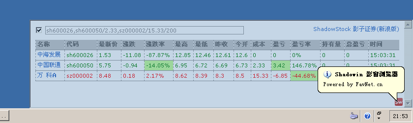

Shadowin 影窗浏览器，通用且隐蔽、配合 ShadowStock 影子证券是上班看股神器
========================================================================

一个`隐蔽型`通用工具，这类玩意在白领圈里非常有市场，呵呵。也许迎合了众多人的实际需求，**Shadowin 影窗浏览器** + **ShadowStock 影子证券**是本人原创软件里用户数最多、地域分布最广的一款软件，自 2009 年发布，不断接受到客户发来的新的增强软件功能的要求，因为它实在是太方便、太 YY 了。 
**[下载已编译包，解压直接使用]**（需 [Microsoft .NET Framework 2.0] 支持）


Shadowin 影窗浏览器 + ShadowStock 影子证券(新浪版)
--------------------------------------------------
* Shadowin 是基于 Windows API 的窗体控制原理延伸出来的专用的**固定 URL 浏览器**。针对上班族开小差这类特殊需求设计：他们可能要关注某个网站某个特定页面的实时内容（比如：股票、小说……），但又不希望周围的人发觉……:)
* Shadowin 会创建一个包含浏览器界面（IE 核心）的半透明窗体隐藏在桌面角落，您可以通过老板键（系统级热键）控制它的显示和隐藏。
* Shadowin 通过文本型 XML 提供程序运行所需的参数，修改它是相当方便的，因此便具有了一软多用的特性。为适应不同页面的浏览需求，Shadowin 亦允许您自行配置喜欢的系统热键（见：[Keys Enumeration]）来自由调整窗体尺寸和透明度。而且某些外观参数也能在 XML 配置文件里找到，改到满意为止吧！
* 初始状态下，Shadowin 已为您设定好非常实用的《[ShadowStock 影子证券(新浪版)]》网站。该站点页面允许您根据投资组合关注自选股（深市sz、沪市sh）、实时价格显示、涨跌警示、持仓盈亏统计、快速链接新浪/谷歌股票页，还能将您想重点关注的单元格`鼠标双击`高亮着色；影子证券程序由纯 Javascript 客户端脚本编制而成，后台链接[新浪财经]实时数据源且比新浪页面更简洁精悍更省流量，与“Shadowin 影窗浏览器”一起使用极具隐蔽性，神不知鬼不觉助您把握股牛、满钵满盏。  
http://tool.iihtml.com/shadowstock/

默认配置和操作方法
------------------
```xml
<appSettings>
    <!--Url-->
    <add key="Url" value="http://tool.iihtml.com/shadowstock/"/>

    <!--自动刷新时间间隔（0表示不刷新）-->
    <add key="RefreshInterval" value="0"/>

    <!--热键-->
    <add key="IncreaseWidthHotKeyModifierKey" value="Control"/>
    <add key="IncreaseWidthHotKeyKey" value="Left"/>
    <add key="DecreaseWidthHotKeyModifierKey" value="Control"/>
    <add key="DecreaseWidthHotKeyKey" value="Right"/>
    
    <add key="IncreaseHeightHotKeyModifierKey" value="Control"/>
    <add key="IncreaseHeightHotKeyKey" value="Up"/>
    <add key="DecreaseHeightHotKeyModifierKey" value="Control"/>
    <add key="DecreaseHeightHotKeyKey" value="Down"/>

    <add key="IncreaseOpacityHotKeyModifierKey" value="Control"/>
    <add key="IncreaseOpacityHotKeyKey" value="Oemplus"/>
    <add key="DecreaseOpacityHotKeyModifierKey" value="Control"/>
    <add key="DecreaseOpacityHotKeyKey" value="OemMinus"/>
    
    <add key="ShowHideHotKeyModifierKey" value="Control"/>
    <add key="ShowHideHotKeyKey" value="D1"/>
    <add key="ExitHotKeyModifierKey" value="Control"/>
    <add key="ExitHotKeyKey" value="D0"/>
</appSettings>
```

|热键		|效果			|
|----		|----			|
|Ctrl + 1	|显示/隐藏窗口	|
|Ctrl + ↑	|增大窗口高		|
|Ctrl + ↓	|减小窗口高		|
|Ctrl + ←	|增大窗口宽		|
|Ctrl + →	|减小窗口宽		|
|Ctrl + +	|增大窗口不透明度	|
|Ctrl + -	|减小窗口不透明度	|
|Ctrl + 0	|退出程序		|

2011-02-18 更新
---------------
應廣大網友要求，最新發佈了《[ShadowStock 影子證券(雅虎奇摩台灣版)]》，後臺連接雅虎奇摩實時數據源，對臺灣股票（tw）實現同樣完美的支持——隱蔽操作、自訂股票、實時行情關注、漲跌警示、盈虧分析等，首開國內兩岸之先河！   
http://tool.iihtml.com/shadowstock/tw/

-------------------------------
如果您是志同道合的朋友，在使用中发现任何问题和建议，请在此留爪。  
**Contact QQ: 9812152 `@Hedda`**

[Keys Enumeration]: https://msdn.microsoft.com/en-us/library/system.windows.forms.keys(v=vs.110).aspx
[ShadowStock 影子证券(新浪版)]: http://tool.iihtml.com/shadowstock/
[ShadowStock 影子證券(雅虎奇摩台灣版)]: http://tool.iihtml.com/shadowstock/tw/
[Microsoft .NET Framework 2.0]: http://www.microsoft.com/zh-cn/download/details.aspx?id=25150
[新浪财经]: http://finance.sina.com.cn
[雅虎奇摩]: https://tw.stock.yahoo.com
[下载已编译包，解压直接使用]: https://github.com/HeddaZ/Shadowin/releases