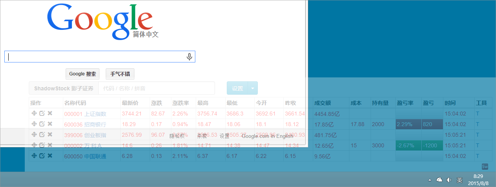
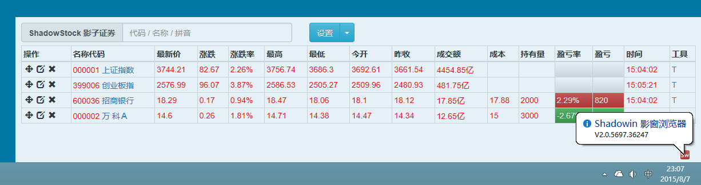
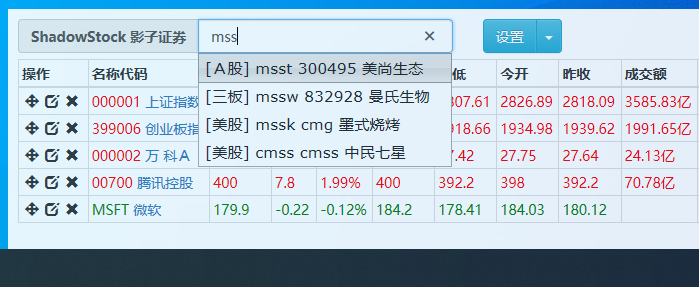
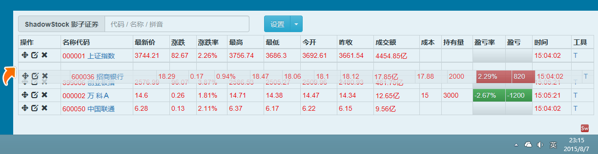
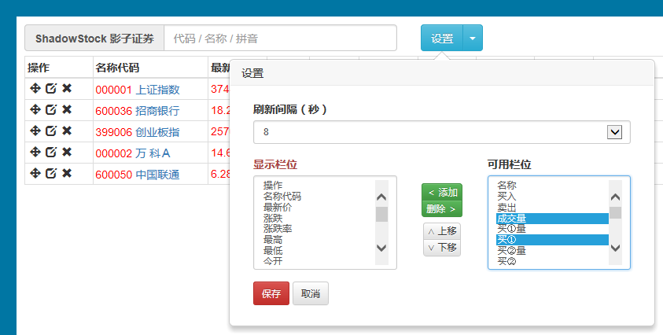
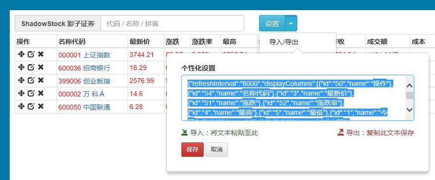

Shadowin 影窗浏览器，支持老板键的透明浏览器外框
---------------------------------------------
冲着 `老板键` 和 `透明窗体` 特性，此类工具在白领圈里非常有市场，呵呵~~  
本软件迎合了多类人群的实际需求，将 **工作时间打酱油** 的精神发挥到顶点。  
  

* Shadowin 基于 WindowsAPI 的窗体控制接口实现，可以通过老板键（系统级热键）控制窗口的尺寸、透明度、显示和隐藏。  
* Shadowin 会创建一个基于 IE 核心的浏览器外框，通过修改 `Shadowin.exe.config` 文件可关注任意 URL 的实时内容（比如：股票、刷秒杀、刷在线、挂等级……）。  
* Shadowin 更允许您自行配置喜欢的系统热键（见：[Keys Enumeration]）和初始外观，改到满意为止吧！  
  
ShadowStock 影子证券，是上班看股、个性化盯盘神器
----------------------------------------------
`Shadowin 影窗浏览器` 和 `ShadowStock 影子证券` 两个方案须配套使用方能发挥神器奇效！  

* ShadowStock 提供了完备的股票盯盘界面（`2015 重制版`中已实现大量激情特性），允许创建您自己的投资组合、实现盯盘、关注实时盈亏；神不知鬼不觉助您把握股牛、满钵满盏。  
* ShadowStock 专为 Shadowin 影窗浏览器设计，站点采用 **纯静态页面 + 客户端脚本** 实现，方便二次部署，后台链接[新浪财经]实时数据源，使用模板引擎思路设计更方便扩展。  
  
  
----------------------------------------------------------------------------------------------
 [下载已编译包，解压直接使用]（运行需 [Microsoft .NET Framework 2.0] 支持）  
  
-----------------------------------------
ShadowStock 影子证券 - 沪深创业板 功能介绍
-----------------------------------------
**2015 重制版支持主流浏览器，地址：**  
> http://shadowstock.iihtml.com/  
  
* 主界面和透明化效果 - 你值得拥有
  
  
* 智能选股列表 - 创建激情投资组合
  
  
* 即时拖动排序 - 把握视觉主次
  
  
* 成本持仓维护 - 关注实时收益
  
  
* 个性化设置 - 体现你的独到见解
  
  
* 设置导入导出 - 回避繁杂、只留方便
  
  
  
Shadowin 影窗浏览器 默认配置和操作方法
-------------------------------------
```xml
<appSettings>
    <!--Url-->
    <add key="Url" value="http://shadowstock.iihtml.com/"/>

    <!--自动刷新时间间隔（0表示不刷新）-->
    <add key="RefreshInterval" value="0"/>

    <!--热键-->
    <add key="IncreaseWidthHotKeyModifierKey" value="Control"/>
    <add key="IncreaseWidthHotKeyKey" value="Left"/>
    <add key="DecreaseWidthHotKeyModifierKey" value="Control"/>
    <add key="DecreaseWidthHotKeyKey" value="Right"/>
    
    <add key="IncreaseHeightHotKeyModifierKey" value="Control"/>
    <add key="IncreaseHeightHotKeyKey" value="Up"/>
    <add key="DecreaseHeightHotKeyModifierKey" value="Control"/>
    <add key="DecreaseHeightHotKeyKey" value="Down"/>

    <add key="IncreaseOpacityHotKeyModifierKey" value="Control"/>
    <add key="IncreaseOpacityHotKeyKey" value="Oemplus"/>
    <add key="DecreaseOpacityHotKeyModifierKey" value="Control"/>
    <add key="DecreaseOpacityHotKeyKey" value="OemMinus"/>
    
    <add key="ShowHideHotKeyModifierKey" value="Control"/>
    <add key="ShowHideHotKeyKey" value="Oemtilde"/>
    <add key="ExitHotKeyModifierKey" value="Control"/>
    <add key="ExitHotKeyKey" value="D0"/>
</appSettings>
```
  
|热键		|效果			|
|----		|----			|
|`Ctrl + ~`	|显示/隐藏窗口（`ESC`下方的`波浪线`，热键更顺手！）	|
|`Ctrl + ↑`	|增大窗口高		|
|`Ctrl + ↓`	|减小窗口高		|
|`Ctrl + ←`	|增大窗口宽		|
|`Ctrl + →`	|减小窗口宽		|
|`Ctrl + +`	|增大窗口不透明度	|
|`Ctrl + -`	|减小窗口不透明度	|
|`Ctrl + 0`	|退出程序		|
  


ShadowStock 影子证券（旧版）
---------------------------
**老版支持 IE7 等更老级别浏览器，地址：**  
> http://shadowstock.iihtml.com/legacy/  
  
  
  
**自选股格式和范例：**  
> 代码[/成本[/持有量]][,代码[/成本[/持有量]]]  
> sh600026,sh600050/2.33,sz000002/20.5/100  
  
**附注：**  
> 填入的股票代码采用[新浪财经]的分类规则。  
> [上证指数]的代码是 sh000001  
> [深证成指]的代码是 sz399001  


ShadowStock 影子證券（雅虎奇摩台灣版）
------------------------------------
應網友要求，2011-02-18 發佈了《ShadowStock 影子證券(雅虎奇摩台灣版)》，後臺連接雅虎奇摩實時數據源，
對臺灣股票（tw）實現同樣完美的支持——隱蔽操作、自訂股票、實時行情關注、漲跌警示、盈虧分析等，首開國內兩岸之先河！   
  
**位址：**  
> http://shadowstock.iihtml.com/tw/  

**自選股格式和範例：**  
> 代號[/成本[/持倉]][,代號[/成本[/持倉]]]  
> tw1101,tw1103/2.33,tw2305/20.5/100  
  
**附註：**  
> 填入的股票代碼需以 tw 作為前綴。  
> [台泥]的代碼是 tw1101  
> [台積電]的代碼是 tw2330  
  

  
注意事项
--------
* `/ShadowStock` 目录下是一个 **纯静态的网站**，放到任何主机上即可使用；  
* ShadowStock 的个性化设置是保存在本地的 Cookie 中的，`2015 重制版`可以支持设置的导入/导出以及通过 QQ 之类的工具传输，而旧版只有选股列表可以跨计算机迁移；
* ShadowStock 影子證券(雅虎奇摩台灣版)调用的是经二次包装的雅虎奇摩数据源 http://tool.iihtml.com/shadowstock/tw/stockdata.aspx?rn={0}&list={1} ，
您可以在 `/TW/Shared.js` 中找到定义，不建议修改；  
  

================================================
  
使用中有任何问题和建议，欢迎[在此留爪]。  
若此软件对您有积极作用，欢迎 **捐赠** 帮助项目发展！  
> QQ: 9812152  
> [支付宝]: heddaz(at)live.com  
> [PayPal]: heddaz(at)live.com  


[Keys Enumeration]: https://msdn.microsoft.com/en-us/library/system.windows.forms.keys(v=vs.110).aspx
[Microsoft .NET Framework 2.0]: http://www.microsoft.com/zh-cn/download/details.aspx?id=25150
[新浪财经]: http://finance.sina.com.cn
[上证指数]: http://finance.sina.com.cn/realstock/company/sh000001/nc.shtml
[深证成指]: http://finance.sina.com.cn/realstock/company/sz399001/nc.shtml
[雅虎奇摩]: https://tw.stock.yahoo.com
[台泥]: https://tw.stock.yahoo.com/q/q?s=1101
[台積電]: https://tw.stock.yahoo.com/q/q?s=2330
[下载已编译包，解压直接使用]: https://github.com/HeddaZ/Shadowin/releases
[在此留爪]: https://github.com/HeddaZ/Shadowin/issues
[支付宝]: http://www.alipay.com
[PayPal]: http://www.paypal.com